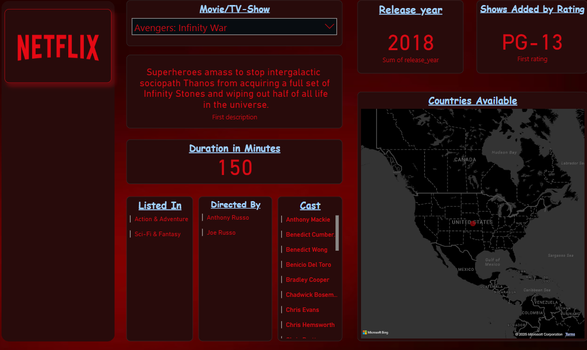
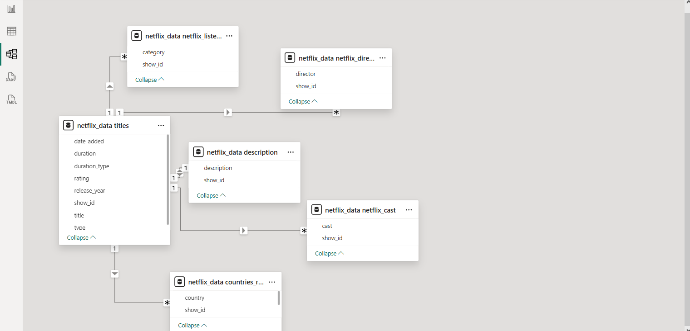

# 🎬 Netflix Dashboard Project using Power BI

This project demonstrates how to analyze and visualize Netflix data using **Power BI**, focusing on relationships, KPIs, and interactive dashboards. The model follows a **Star Schema**, and relationships were built using SQL before importing into Power BI.

---

---

## 📁 1. Data Sources

The dataset includes various CSV files containing information on Netflix shows:

- Titles and metadata
- Cast
- Directors
- Genre/category
- Descriptions
- Countries

---

## 🧱 2. Data Modeling: Star Schema with SQL Relationships

This project uses a **Star Schema** data model to optimize query performance and simplify analysis in Power BI.

### 🔧 SQL-Based Relationship Creation

Before importing into Power BI, relationships were established using **SQL joins** based on the `show_id` field. This ensured data integrity and normalized structure across the dataset.

---

## ⭐ Star Schema Breakdown

### 🔸 Fact Table
- `netflix_data_titles`
  - Contains: `title`, `type`, `release_year`, `date_added`, `duration`, `rating`, etc.

### 🔹 Dimension Tables

| Table                                | Description               |
|-------------------------------------|---------------------------|
| `netflix_data_netflix_listed_in`    | Genre or category         |
| `netflix_data_netflix_director`     | Director of the show      |
| `netflix_data_netflix_cast`         | Main cast members         |
| `netflix_data_description`          | Content descriptions      |
| `netflix_data_countries_refined`    | Country of origin         |

All dimension tables connect to the fact table via the `show_id` key, forming a classic **Star Schema**.

---

## 📊 3. Power BI Dashboard Features

- Created **interactive visualizations** using slicers, bar charts, pie charts, and KPI indicators
- Built **measures** using DAX for calculating:
  - Total number of shows
  - Percentage of TV Shows vs Movies
  - Top 10 genres or countries
  - Year-wise release trends

---

## 🔍 4. Key Learnings

- Data modeling using **relational tables** in Power BI
- Importance of **Star Schema** for performance
- Creating **measures and KPIs** for business insights
- Visual storytelling through dashboards

---

## 🧠 Tools Used

- Microsoft Power BI
- SQL (for relational modeling)
- Excel/CSV for data cleaning

---

## 🖼️ Data Model Preview

> This image shows how the tables are linked using `show_id` with clean relationships.

---

Let me know if you'd like this turned into a portfolio project or hosted on GitHub!
